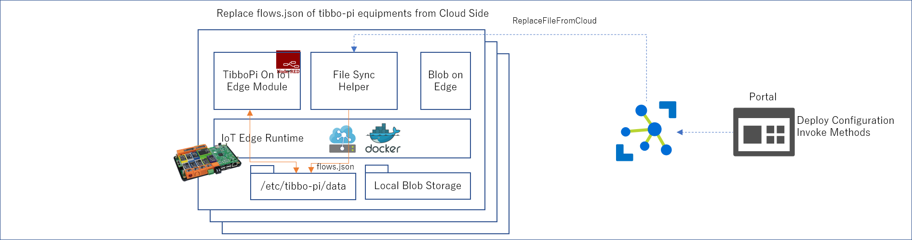

# [Tibbo-Pi](https://tibbo-pi.co-works.co.jp/) × [Azure IoT Edge](https://docs.microsoft.com/ja-jp/azure/iot-edge/) 
このモジュールは、embeddedgeorge/tibbopi-iot-edge-module:0.2.1-arm32v7 から利用可能。 

## 使用方法 
1. Raspberry Pi(Tibbo-Pi)のマイクロSDカードを、RaspbianのStrechで初期化し、セットアップする 
2. Azure IoT Edge Runtime をインストールする。インストール方法は[こちら](https://docs.microsoft.com/ja-jp/azure/iot-edge/how-to-install-iot-edge-linux) 
3. IoT Edge Module の Build と 配置 - 以下を参照 

### Build と配置 
#### Docker に詳しい人向け 
ラズパイに、このディレクトリ以下をコピーし、以下を実行  
$ sudo docker build -t tibbopi-iot-edge-module -f Dockerfile.arm32v7 .  
$ sudo docker build tag tibbopi-iot-edge-module <i>your-docker-repository</i>/tibbopi-iot-edge-module  
$ docker push <i>your-docker-repository</i>/tibbopi-iot-edge-module:latest  
これで、Azure IoT Hub、IoT Edge デバイスから使えるようになるので、Azure ポータルなどで、IoT Edge デバイスに配置する。 
配置の際のコンテナ―生成オプションはは、  
```json
{
  "HostConfig": {
    "PortBindings": {
      "5671/tcp": [
        {
          "HostPort": "5671"
        }
      ],
      "8883/tcp": [
        {
          "HostPort": "8883"
        }
      ],
      "443/tcp": [
        {
          "HostPort": "443"
        }
      ],
      "1880/tcp": [
        {
          "HostPort": "1880"
        }
      ]
    },
    "Binds": [
      "/etc/tibbo-pi/data:/data",
      "/dev/mem:/dev/mem",
      "/dev/i2c-1:/dev/i2c-1"
    ],
    "Privileged": true
  }
}
```

Blob on Edge と file-sync-helper を併用すると、Node-Red のフローをリモートで収集・更新が可能になる。 

#### Flow のリモート取得と、配布  
[file-sync-helper](../../helper/NodeRedHelperModules/modules/FyleSyncHelperModule) を併用することにより、ある一台の Tibbo-Pi で定義した Node-Red のフロー(flows.json)を、IoT Hub を通じて取得し、他の Tibbo-Pi のフローを取得したフローで更新することが可能である。  
 
で、flows.json を、 Azure の Blob Storage に格納し、 
 
で、別の Tibbo-Pi に、格納したFlows.json の中身を送り込み、 

で、Node-Red にフローの変更を、 [REST API](https://nodered.org/docs/api/) を参考に指示する。  
※ うーん。。。REST APIでアクセスするなら、その辺パッケージングしたHelperもありか。。。

#### VS Code + Azure IoT Edge Extension を使う場合  

※ 書きかけ 
